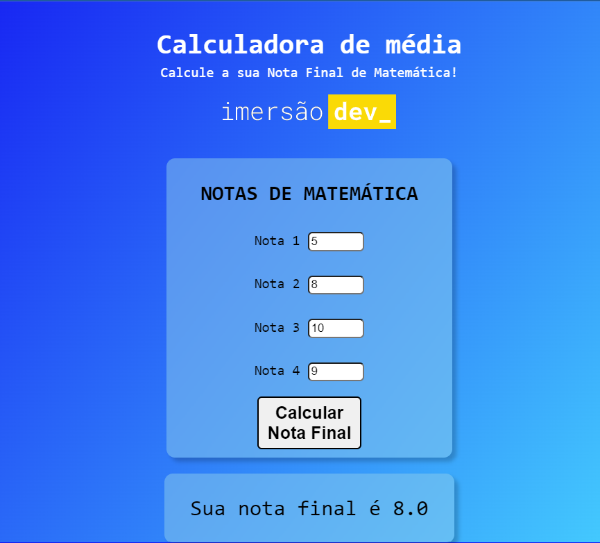

# Desafio - Alura

Esse foi o resultado do Calculadora de Média utilizando o que aprendi com JS, HTML e CSS.

Projeto proposto na Imersão Alura.

## Índice

  - [Visão Global](#visão-global)
  - [Screenshot](#screenshot)
  - [Links](#links)
  - [O processo](#o-processo)
  - [Construção](#construção)
  - [Aprendizado](#aprendizado)
  - [Desenvolvimento contínuo](#desenvolvimento-contínuo)
  - [Recursos úteis](#recursos-úteis)
  - [Autor](#autor)

## Visão Global

### Screenshot

<!-- ### Links

- Solution URL: [Add solution URL here](https://your-solution-url.com)
- Live Site URL: [Add live site URL here](https://your-live-site-url.com) -->

## O processo

O processo de construção deste desafio, envolveu a busca de informações em documentações sobre Java Script, para atividades com funcionalidade junto ao cliente.

### Construção

- Conceitos de JavaScript
- Semântica de HTML5
- Propriedades básicas de CSS

### Aprendizado

Com esse desafio completo, foi possível aprender os conceitos básicos de JavaScript, utilizar os conhecimentos de HTML e CSS.

### Desenvolvimento contínuo

Com os primeiros passos de JavaScript, irei buscar mais informações sobre novos comandos e a integração com o HTML e CSS de forma mais eficiente.

<!-- ### Recursos úteis

- [MDN - Elementos HTML](https://developer.mozilla.org/pt-BR/docs/Web/HTML/Element/Heading_Elements) - Através do documento MDN, foi possível esclarecer muito sobre H1 e outros títulos utilizados em HTML.
- [MDN - Atributos Globais](https://developer.mozilla.org/pt-BR/docs/Web/HTML/Element/a) - Atrvés do documento MDN, essencial para aprender sobre os atributos globais e a utilziação dos elementos âncoras dentro do HTML.
- [MDN - Divisão](https://developer.mozilla.org/pt-BR/docs/Web/HTML/Element/div) - Com essa documentação, é possível verificar uma das formas genéricas de fazer a divisão no projeto. -->

## Autor

- Frontend Mentor - [@santiagosegre](https://www.frontendmentor.io/profile/santiagosegre)
- Linkedin - [@santiagosegre](https://www.linkedin.com/in/santiago-segre-191407157/)
- Instagram - [@santisegre](https://www.instagram.com/santisegre/)