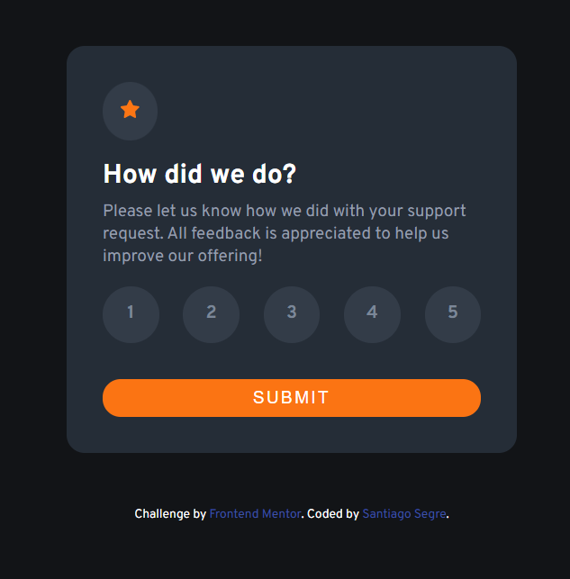
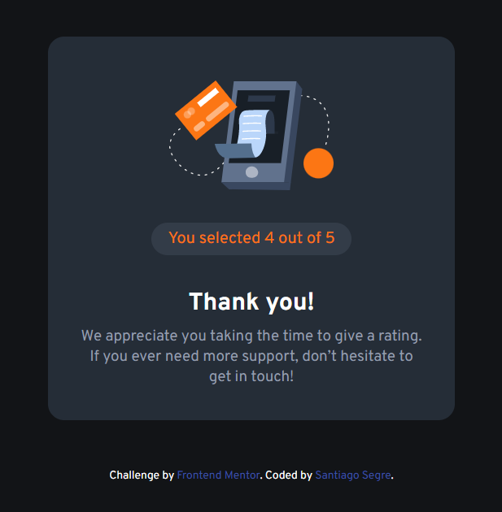
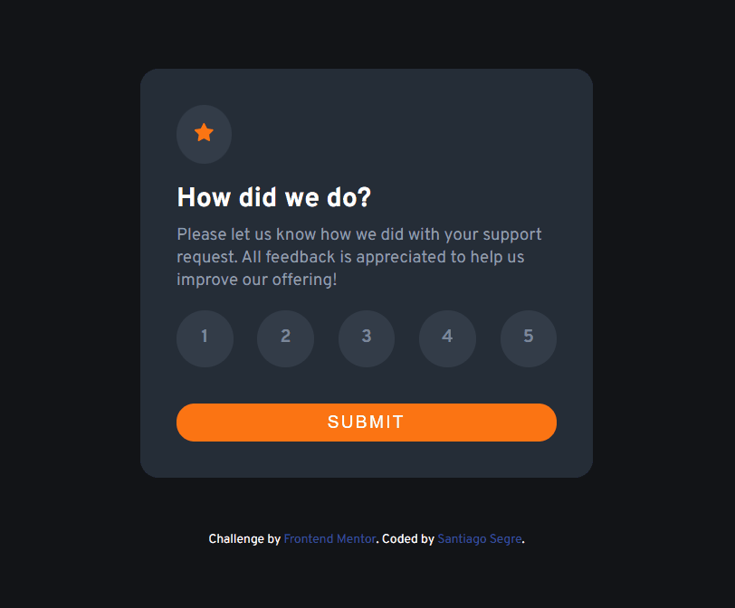

# Desafio - Frontend Mentor - Interactive rating component

Esse foi o resultado do [Interactive rating component - challenge on Frontend Mentor](https://www.frontendmentor.io/challenges/interactive-rating-component-koxpeBUmI), utilizando o que aprendi com HTML, CSS e JS.

Frontend Mentor challenges help you improve your coding skills by building realistic projects. 

## Índice

  - [Visão Global](#visão-global)
  - [Projeto](#projeto)
  - [Screenshot](#screenshot)
  - [Links](#links)
  - [O processo](#o-processo)
  - [Construção](#construção)
  - [Aprendizado](#aprendizado)
<!-- - [Desenvolvimento contínuo](#desenvolvimento-contínuo) -->
<!-- - [Recursos úteis](#recursos-úteis) -->
  - [Autor](#autor)

## Visão Global

### Projeto

### Screenshot

Resultado:

### Links

- Live Site URL: [Interactive rating component - Live](https://santiagosegre.github.io/desafios/interactive-rating-component-main/)
- Solution URL: [Interactive rating component - Repositório](https://github.com/santiagosegre/interactive-rating-component-main)

## O processo

O processo de construção deste projeto utilizei recursos novos com o auxílio da documentação MDN.

### Construção

- Semântica de HTML5
- Propriedades básicas de CSS
- Propriedades básicas de JS para criar funções de cliques, eventos.

### Aprendizado

Com esse desafio completo, foi possível colocar em prática ainda mais os conceitos de HTML, CSS e JS, utilizando recursos de linguagem básicas, mas com eficiência. 

## Autor

<!-- - Website - [Add your name here](https://www.your-site.com) -->
- Frontend Mentor - [@santiagosegre](https://www.frontendmentor.io/profile/santiagosegre)
- Linkedin - [@santiagosegre](https://www.linkedin.com/in/santiagosegre/)
- Instagram - [@santisegre](https://www.instagram.com/santisegre/)