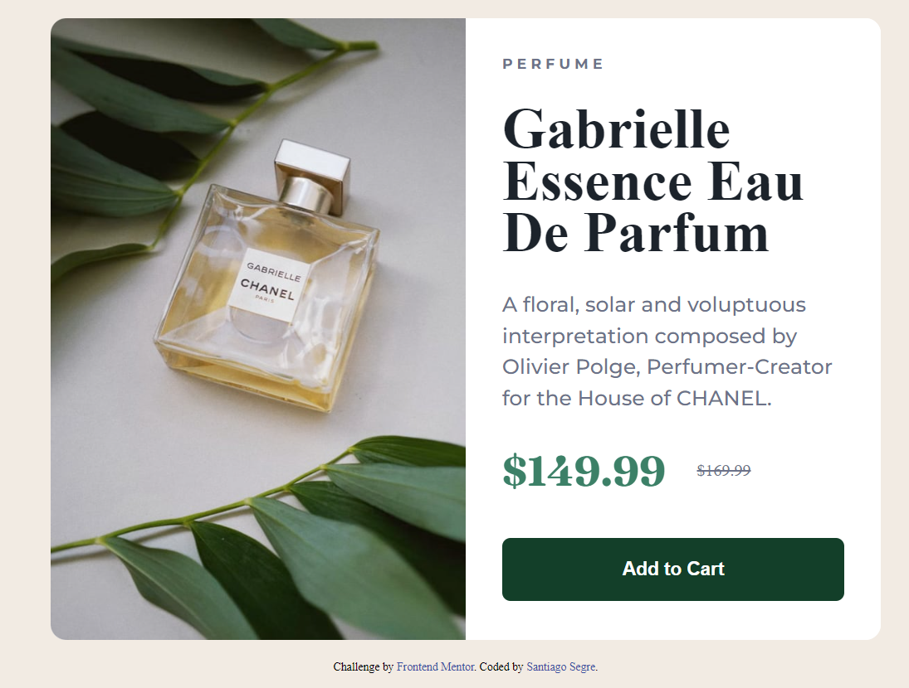

# Desafio - Frontend Mentor - QR Code

Esse foi o resultado do [Product preview card component challenge on Frontend Mentor](https://www.frontendmentor.io/challenges/product-preview-card-component-GO7UmttRfa), utilizando o que aprendi com HTML e CSS.

Frontend Mentor challenges help you improve your coding skills by building realistic projects. 

## Índice

  - [Visão Global](#visão-global)
  - [Screenshot](#screenshot)
  - [Links](#links)
  - [O processo](#o-processo)
  - [Construção](#construção)
  - [Aprendizado](#aprendizado)
  <!-- - [Desenvolvimento contínuo](#desenvolvimento-contínuo)
  - [Recursos úteis](#recursos-úteis) -->
  - [Autor](#autor)

## Visão Global

### Screenshot

### Links

- Solution URL: [Product Preview Card - Repositório](https://github.com/santiagosegre/desafios/tree/main/product-preview-card)
- Live Site URL: [Product Preview Card - Live](https://santiagosegre.github.io/desafios/product-preview-card/)

## O processo

O processo de construção deste projeto utilizei recursos novos com o auxílio da documentação MDN.

### Construção

- Semântica de HTML5
- Propriedades básicas de CSS

### Aprendizado

Com esse desafio completo, foi possível colocar em prática ainda mais os conceitos de HTML e CSS, conseguindo aprimorar ainda mais o CSS. 

## Autor

<!-- - Website - [Add your name here](https://www.your-site.com) -->
- Frontend Mentor - [@santiagosegre](https://www.frontendmentor.io/profile/santiagosegre)
- Linkedin - [@santiagosegre](https://www.linkedin.com/in/santiago-segre-191407157/)
- Instagram - [@santisegre](https://www.instagram.com/santisegre/)