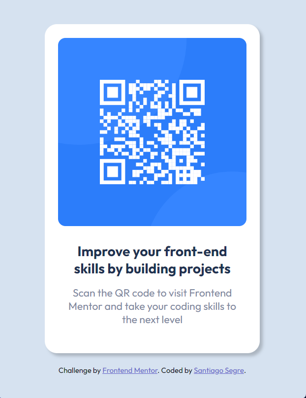
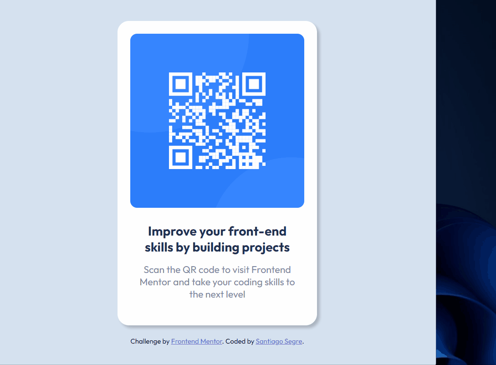

# Desafio - Frontend Mentor - QR Code

Esse foi o resultado do [QR code component challenge on Frontend Mentor](https://www.frontendmentor.io/challenges/qr-code-component-iux_sIO_H), foi o primeiro desafio que realizei, utilizando o que aprendi com HTML e CSS.

Frontend Mentor challenges help you improve your coding skills by building realistic projects. 


## Índice

  - [Visão Global](#visão-global)
  - [Screenshot](#screenshot)
  - [Links](#links)
  - [O processo](#o-processo)
  - [Construção](#construção)
  - [Aprendizado](#aprendizado)
  - [Desenvolvimento contínuo](#desenvolvimento-contínuo)
  - [Recursos úteis](#recursos-úteis)
  - [Autor](#autor)


## Visão Global

### Screenshot






### Links

- Solution URL: [Add solution URL here](https://your-solution-url.com)
- Live Site URL: [Add live site URL here](https://your-live-site-url.com)

## O processo

O processo de construção deste primeiro projeto não foi fácil, mas com o auxílio da documentação MDN, a realização do desafio se torma mais efetiva. 

### Construção

- Semântica de HTML5
- Propriedades básicas de CSS

### Aprendizado

Com esse desafio completo, foi possível aprender os conceitos básicos do HTML e CSS, desde a contrução e marcação dos elementos importantes, para apriporar ainda mais o CSS. 

A utilziação de atributos globais e genéricos, formando uma estrutura simples de se trabalhar:

```html
  <div class="container">
    <div class="card">
      
      <div class="text">
        <h2>Improve your front-end skills by building projects</h2>
        <p>Scan the QR code to visit Frontend Mentor and take your coding skills to the next level</p>
      </div>
    </div>
```

Utilização de um Elemento âncora:

```html
  <div class="attribution">
    Challenge by <a rel="noopener" href="https://www.frontendmentor.io?ref=challenge" target="_blank">Frontend Mentor</a>. Coded by <a
      href="https://github.com/santiagosegre">Santiago Segre</a>.
  </div>
```

E um dos mais básicos conceitos para estilização:

```css
.card {
    background-color: hsl(0, 0%, 100%);
    padding: 22px;
    text-align: center;
    border-radius: 20px;
    box-shadow: 5px 5px 5px rgba(0, 0, 0, 0.2);
    margin-bottom: 20px;
}
```

### Desenvolvimento contínuo

Com esse primeiro desafio realizado, irei buscar mais informações sobre a documentação HTML, em como estruturar a base para ter um melhor desempenho na estilização com CSS nos projetos.

### Recursos úteis

- [MDN - Elementos HTML](https://developer.mozilla.org/pt-BR/docs/Web/HTML/Element/Heading_Elements) - Através do documento MDN, foi possível esclarecer muito sobre H1 e outros títulos utilizados em HTML.
- [MDN - Atributos Globais](https://developer.mozilla.org/pt-BR/docs/Web/HTML/Element/a) - Atrvés do documento MDN, essencial para aprender sobre os atributos globais e a utilziação dos elementos âncoras dentro do HTML.
- [MDN - Divisão](https://developer.mozilla.org/pt-BR/docs/Web/HTML/Element/div) - Com essa documentação, é possível verificar uma das formas genéricas de fazer a divisão no projeto.

## Autor

<!-- - Website - [Add your name here](https://www.your-site.com) -->
- Frontend Mentor - [@santiagosegre](https://www.frontendmentor.io/profile/santiagosegre)
- Linkedin - [@santiagosegre](https://www.linkedin.com/in/santiago-segre-191407157/)
- Instagram - [@santisegre](https://www.instagram.com/santisegre/)